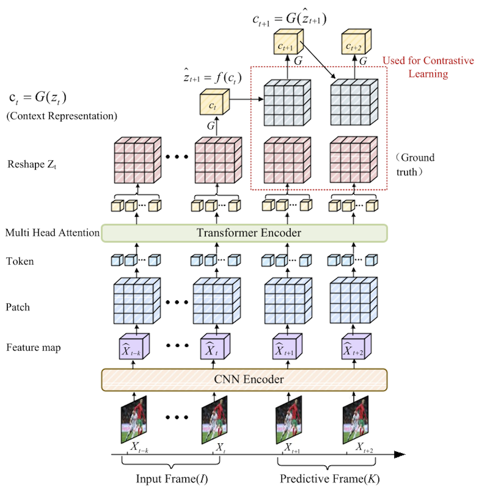
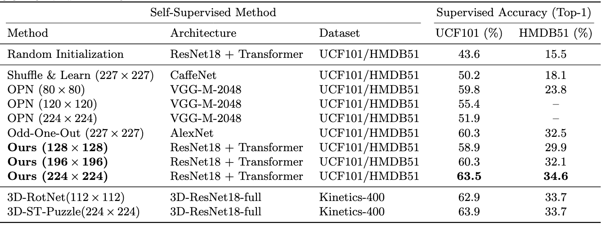

## SSL For Video Understanding

This repository completes the video Self-Supervised Learning framework based on CPC idea and Vision Transformer
<p align="center">
  
</p>


### Finetune Results

Best Performance result from this implementation(**5pred3 + 7pred3**):

| Pretrain Dataset| Resolution | Backbone | Finetune Acc@top-1 (UCF101) | Finetune Acc@Top-1 (HMDB51) |
|----|----|----|----|----|
|UCF101|224x224|2d-R18+Transformer| **<div align="center">63.5</div>** |**<div align="center">34.6</div>**|
|UCF101|196x196|2d-R18+Transformer| <div align="center">60.3</div> |<div align="center">32.1</div>|
|UCF101|128x128|2d-R18+Transformer| <div align="center">58.9</div> |<div align="center">29.9</div>|


### Installation

The implementation should work with python >= 3.8, pytorch >= 0.4, torchvision >= 0.2.2. 

The repo also requires cv2, tensorboardX >= 1.7

### Prepare data

Please download HMDB51 and UCF101 dataset along with their three splits, then use `/ProcessData` to extract frames from video.

- HMDB51:
  - Dataset: [HMDB51 (RAR)](https://serre-lab.clps.brown.edu/wp-content/uploads/2013/10/hmdb51_org.rar)
  - Official three splits: [test_train_splits.rar](https://serre-lab.clps.brown.edu/wp-content/uploads/2013/10/test_train_splits.rar)

- UCF101:
  - Dataset: [UCF101 (RAR)](https://www.crcv.ucf.edu/data/UCF101/UCF101.rar)
  - Official train/test splits: [UCF101TrainTestSplits-RecognitionTask.zip](https://www.crcv.ucf.edu/data/UCF101/UCF101TrainTestSplits-RecognitionTask.zip)

### Self-supervised training

Change directory `cd CPCTrans/CPCTrans/`

* example: train SSL model using 1 GPUs(about 28 hours with one RTX4090 GPU), with ResNet18 backbone, on UCF101 dataset with 224x224 resolution, for 300 epochs
  ```
  python main.py --net resnet18 --dataset ucf101 --batch_size 16 --img_dim 224 --epochs 300 --num_seq 5 --pred_step 3
  ```

### Evaluation: Supervised Action Classification

Change directory `cd CPCTrans/Evaluate/`

* example: finetune pretrained weights (replace `{model.pth.tar}` with pretrained SSL model)
  ```
  python test.py --net resnet18 --dataset ucf101 --batch_size 16 --img_dim 224 --pretrain {model.pth.tar} --train_what ft --epochs 300 --num_seq 7 --pred_step 3
  ```

## 🔗 Pretrained / finetuned weights

Download link:

- UCF101 pretrain (self-supervised):
  - [2D-ResNet18 — UCF101 — 224×224 — SSL](https://drive.google.com/file/d/1XHIbSzbMaVXcBn86Qu5LbIKo2edzOphN/view?usp=drive_link)

- UCF101 finetune:
  - [2D-ResNet18 — UCF101 — 224×224 — Finetune](https://drive.google.com/file/d/1htAxdKIYCJhSM4QVbhM-eH0uG9-Ry3sz/view?usp=drive_link)

## Test Classification Ability
* example (continued): test the finetuned model (replace `{finetune_model.pth.tar}` with finetuned classifier model)
  ```
  python test.py --net resnet18 --dataset ucf101 --batch_size 16 --img_dim 224 --test {finetune_model.pth.tar}
  ```
## Comparison with Other Self-Supervised Learning Method
<p align="center">
  
</p>


